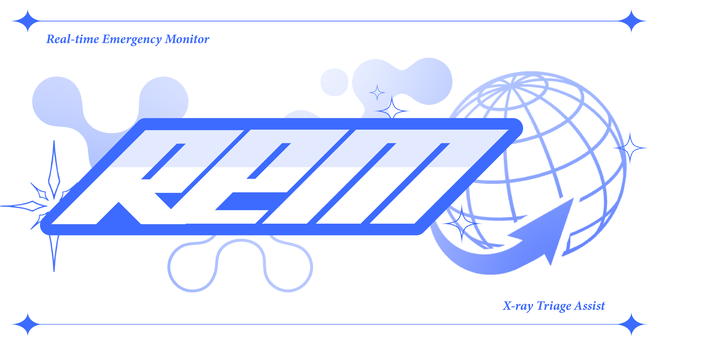

<div align="center">

# 🏥 REM XTA: Real-time Emergency Monitor
### 흉부 X-ray & 바이탈 멀티모달 기반 응급실 판독 보조 솔루션


[📺 데모 영상](#-project-demo) • [📄 디자인 가이드](#-design-reference) • [🚀 시작하기](#-getting-started)

</div>

---

## 📖 Introduction

**REM XTA(X-ray Triage Assist)** 는 과밀화된 응급실 환경에서 의료진의 신속하고 정확한 의사결정을 돕기 위해 개발된 웹 애플리케이션입니다.

단순한 이미지 분류를 넘어, **흉부 엑스레이(CXR)** 와 환자의 **활력 징후(Vital Signs)** 데이터를 결합한 **멀티모달(Multimodal) 딥러닝 모델**을 사용하여 폐질환 진단 정확도를 높였습니다.

---

## 📺 Project Demo

실제 웹 애플리케이션의 구동 모습과 시나리오 시연 영상입니다.

[](https://www.youtube.com/watch?v=cdm94JtcWEc)

> **💡 시연 시나리오:** 환자 등록 → 바이탈/X-ray 입력 → AI 멀티모달 분석 → 히트맵 확인 → Triage(응급도) 분류

---

## ✨ Key Features

본 프로젝트는 현업 수준의 **UI/UX 가이드라인(REM UI Design Guide v1.0)** 을 수립하고 이를 준수하여 개발되었습니다.

### 1. Smart Triage Dashboard
- **응급도 자동 분류:** AI 분석 결과와 KTAS(한국형 응급환자 분류도구) 기준에 따라 위급 환자를 리스트 최상단에 자동 정렬
- **실시간 모니터링:** Critical / Warning / Normal 상태를 직관적인 컬러 코드로 표시

### 2. Specialized Viewer & Comparison
- **Side-by-Side 비교:** 환자의 과거 영상과 현재 영상을 나란히 배치하여 병변의 변화를 추적
- **AI Heatmap:** 모델이 주목한 병변 위치를 히트맵(CAM)으로 시각화하며, On/Off 토글 가능

### 3. Optimized for ER Workflow
- **Scroll-free Interface:** 분초를 다투는 상황에서 정보 탐색 시간을 줄이기 위해, 스크롤 없는 단일 화면(Single-screen) 인터페이스 구현
- **Flat Clinical UI:** 의료진의 피로도를 낮추고 정보 가독성을 높이기 위해 그림자와 장식을 배제한 Flat Design 적용

---

## 🛠 Tech Stack

| Category | Technologies |
|----------|-------------|
| **Frontend** | React, Vite, CSS Modules |
| **AI Model** | PyTorch, DenseNet-121, Gated Cross Attention |
| **Environment** | Google Colab Pro |
| **Dataset** | MIMIC-CXR (Image) + Pseudo Vital Data + Hospial WBC, BNP |

---

## 📂 Directory Structure

```
REM-XTA/
├── 📂 assets/                 # 배너, 스크린샷 이미지
├── 📂 docs/                   # 기획서 및 디자인 가이드 (PDF)
├── 📂 frontend/               # React 웹 애플리케이션 (Vite)
│   ├── src/
│   ├── public/
│   └── README.md              # 프론트엔드 실행 가이드
├── 📂 ai-model/               # AI 모델 학습 코드
│   ├── notebooks/             # Colab 학습용 .ipynb 파일
│   ├── weights/               # 학습된 모델 가중치
│   └── requirements.txt
└── README.md
```

---

## 🚀 Getting Started

### 1. Frontend (Web Client)

```bash
cd frontend
npm install
npm run dev
```

> **Requirements:** Node.js 18+

### 2. AI Model Training

1. `ai-model/notebooks/` 폴더의 `01_multimodal_training.ipynb` 파일을 Google Colab에서 엽니다.
2. 런타임 유형을 **GPU**로 설정한 후 셀을 순차적으로 실행합니다.

> ⚠️ **Note:** 민감한 환자 데이터셋은 저장소에 포함되어 있지 않습니다. 제공된 샘플 데이터(`sample_vital.csv`)를 활용하거나 별도의 데이터 경로를 설정해야 합니다.

---

## 🎨 Design Reference

이 프로젝트는 현업 수준의 UI/UX 기획 단계를 거쳐 개발되었습니다.

> 📄 **[View Full Design Guide (PDF)](./docs/REM_XTA_UI_Design_Guide.pdf)**

### Design Philosophy: Flat Clinical UI

| Principle | Description |
|-----------|-------------|
| **Minimalism** | 그림자와 그라디언트를 배제하여 시각적 피로도 최소화 |
| **Scroll-free** | 모든 핵심 정보를 한눈에 파악할 수 있는 Single-screen Layout |
| **Medical-Safe Colors** | 신뢰감을 주는 Signature Blue(`#3D6BFF`)와 Soft Semantic Colors 사용 |

### Benchmarking

- **Lunit INSIGHT CXR**의 핵심 기능을 벤치마킹
- 과거 영상 자동 비교(Side-by-Side) 및 AI 임계값(Threshold) 조정 기능 구현

### Color System

| Role | Color | Hex |
|------|-------|-----|
| Primary | Signature Blue | `#3D6BFF` |
| Critical | Soft Red | `#E85468` |
| Normal | Soft Green | `#52C39A` |

---

## 📬 Contact

- **Author:** 조성은
- **Email:** shap2819@hs.ac.kr
- **GitHub:** [@chosungun](https://github.com/chosungun)

---

<div align="center">

이 프로젝트가 도움이 되셨다면 ⭐️ **Star**를 눌러주세요!

</div>